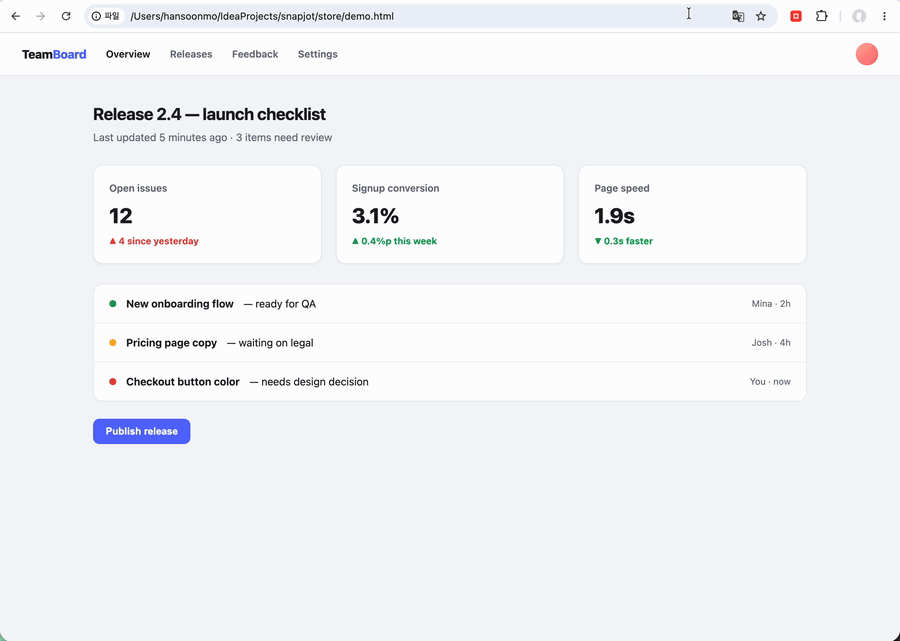

# SnapJot

Snap a region of any web page, add a **box**, an **arrow sticker** or a **quick note**, and **copy straight to your clipboard** (paste into Slack/Notion/email with `Cmd/Ctrl+V`). No account, no cloud — everything stays on your machine.

A deliberately small, fast alternative to bloated all-in-one screenshot tools.



## How it works
1. Click the SnapJot toolbar icon — or press the shortcut (default **Cmd/Ctrl + Shift + S**; change it at `chrome://extensions/shortcuts`).
2. Drag to select an area (the page freezes so the selection is stable).
3. Use the toolbar: **Box** to draw a red rectangle, **Text** to drop a quick note.
4. **Copy** → it's on your clipboard. Or **Save** to download a PNG. `Esc` cancels anytime.

## Load it locally (development)

**Chrome:**
1. Open `chrome://extensions`.
2. Turn on **Developer mode** (top-right).
3. Click **Load unpacked** and select this `snapjot/` folder.
4. Pin SnapJot to the toolbar, open any normal web page, and click the icon.

**Firefox (and Firefox-based browsers like Zen):**
1. Run `node tools/build.js` to generate `dist/firefox/`.
2. Open `about:debugging#/runtime/this-firefox`.
3. Click **Load Temporary Add-on…** and select `dist/firefox/manifest.json`.
4. Note: the shortcut is **Alt+Shift+S** on Firefox (Cmd/Ctrl+Shift+S is taken by Firefox's built-in screenshot tool). Requires Firefox 127+ for clipboard image copy.

> Protected pages (`chrome://…`, the Chrome Web Store) can't be captured — that's a browser restriction. Try it on a regular site.

## Internationalization (i18n)
UI strings live in `_locales/<lang>/messages.json` and are loaded via `chrome.i18n`.
- Default language: **English** (`_locales/en`)
- Also included: **Korean** (`_locales/ko`)
- The shown language follows the browser's UI language, falling back to English.
- **To add a language:** copy `_locales/en/messages.json` into `_locales/<lang>/` and translate the `message` values. No code changes needed.

## Project layout
```
manifest.json          MV3 manifest (default_locale: en)
background.js          captures the tab, injects the content script
content.js            selection + annotation + clipboard (zero deps)
_locales/en, _locales/ko   UI strings
```

## Status — MVP (v0.1.0)
- [x] Capture visible area → select region → box + text → copy to clipboard / save PNG
- [x] i18n scaffold (en, ko)
- [x] Toolbar icons (`tools/gen-icons.js` — pure-Node PNG generator, regenerate anytime)
- [ ] Manual test in Chrome (load unpacked, see below) — **needs a human**
- [ ] Color / line-width options
- [ ] Paid hook (v2 idea): **destructive redaction** — permanently black out sensitive info before sharing (solid fill, not reconstructable blur)
- [ ] Publish to Chrome Web Store ($5 one-time dev registration) + first 10 users

## Package for the stores
```sh
node tools/build.js
```
Produces `dist/snapjot-chrome-v<version>.zip` (Chrome Web Store) and `dist/snapjot-firefox-v<version>.zip` (addons.mozilla.org). The Firefox manifest is derived automatically (event-page background, `browser_specific_settings.gecko`, Alt+Shift+S shortcut).

## Notes
- Permissions are intentionally minimal: `activeTab` + `scripting` (no broad host access) — better for trust and store review.
- Clipboard image copy needs a secure context; on plain `http://` pages it falls back to a PNG download automatically.
